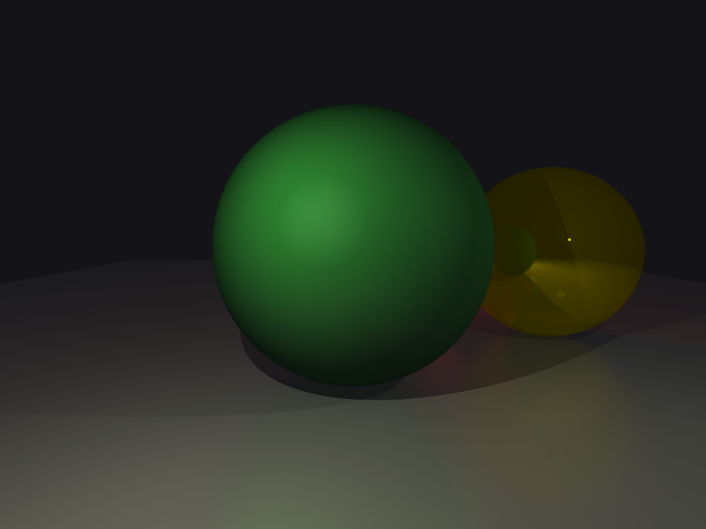

Generates an image from a scene with a raytracing algorithm

Usage: raytracer [OPTIONS]

Options:
  -i, --input <INPUT>        [default: scene.xml]
  -o, --output <OUTPUT>      [default: image.png]
  -p, --parallel <PARALLEL>  [default: no] [possible values: no, basic, rayon]
  -h, --help                 Print help
  -V, --version              Print version
